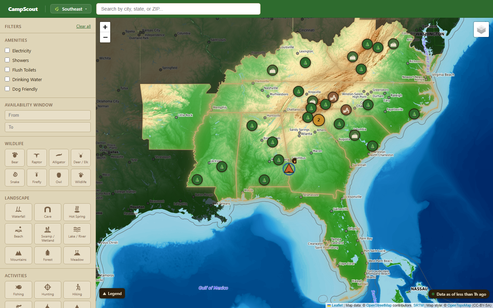
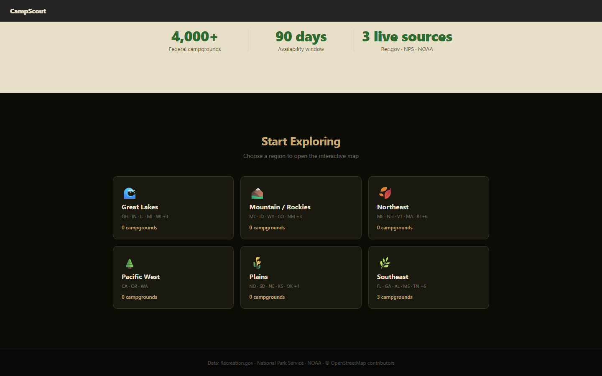
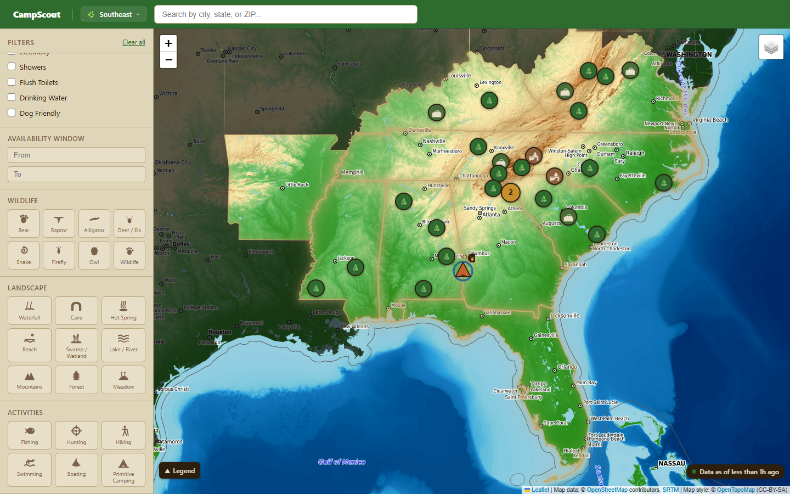
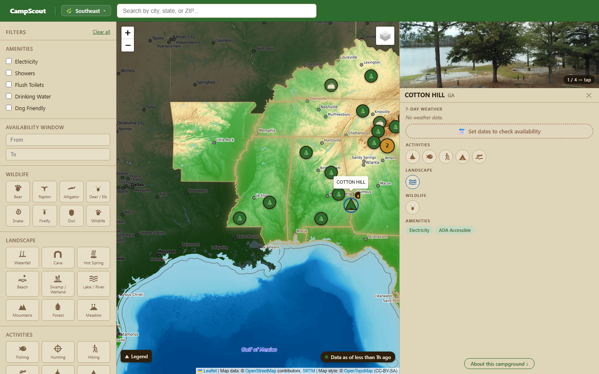
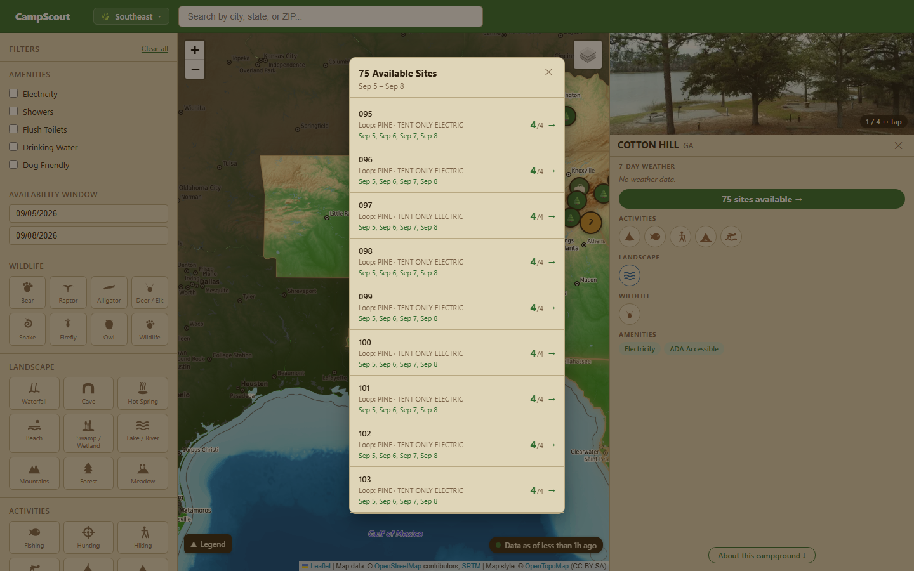

# CampScout — Federal Campsite Search & Availability

Finding an open federal campsite shouldn't require five browser tabs, three government websites, and a weather app. CampScout pulls availability, weather, and campground details into one map-first dashboard — updated automatically every day.

**[→ Try the live demo](https://campscout-delta.vercel.app)** — no sign-up required

---

[](https://campscout-delta.vercel.app)

---

## The Problem

Recreation.gov tells you if a site is available. It doesn't tell you what wildlife lives there, whether there's shade, or what the weather looks like that weekend. NPS has the descriptions. NOAA has the weather. None of them talk to each other. Campers piece it all together manually every time.

## What CampScout Does

- **Live availability** — Recreation.gov data refreshed daily, per-campsite windows so you can see exactly which sites are open on your dates
- **7-day weather** — NOAA forecasts pulled per campground, cached and served without hitting the API on every request
- **Structured tags** — wildlife, landscape, and activity tags extracted from freeform NPS descriptions using keyword extraction, so you can actually filter by "bear country" or "waterfall"
- **Automated pipeline** — GitHub Actions runs the full ETL on a schedule; the DB always reflects current availability without any manual intervention

---

## How It Works — From Region to Reservation

### 1. Pick a Region

The home page shows all six US regions with live campground counts pulled from the API. Selecting one snaps the map to that region's bounding box and loads its campgrounds.

[](https://campscout-delta.vercel.app)

### 2. Explore the Map

Campgrounds appear as clustered markers. Zooming in breaks clusters into individual sites — each marker shows a wildlife badge and terrain ring at a glance. The map is constrained to the selected region with a state-shape overlay that grays out everything outside it.

[](https://campscout-delta.vercel.app)

### 3. Filter Campgrounds

The filter panel narrows by amenities (electricity, showers, drinking water, pet-friendly, ADA), wildlife tags, landscape type, and activities. Filters combine — electric sites near a waterfall that allow dogs is a single query, not three.

[](https://campscout-delta.vercel.app)

### 4. View Campground Details

Clicking a marker opens the detail panel: photo gallery, 7-day weather strip, activities, landscape, wildlife emblems, amenity chips, and NPS alerts. First-come-first-serve campgrounds show a walk-in badge instead of a date picker — no misleading "no availability" messaging for sites that don't use the reservation system.

[](https://campscout-delta.vercel.app)

### 5. Check Availability

Set arrival and departure dates in the filter panel. Available site counts appear on each campground marker. Click through to the availability modal for a per-site breakdown — site name, loop, type, and every available date in the window.

[](https://campscout-delta.vercel.app)

---

## Stack

| Layer | Tech | Why |
|---|---|---|
| Orchestration | Prefect 2 | Per-source retries and failure isolation across 3 differently-paced APIs — not a cron script |
| Database | PostgreSQL + PostGIS (Neon) | Geospatial joins for NOAA station lookup are core, not an afterthought |
| Backend | FastAPI + SQLAlchemy + GeoAlchemy2 | Async-friendly for polling multiple slow government APIs |
| Frontend | React + react-leaflet | Map-first dashboard; OSM tiles avoid any Mapbox billing dependency |
| Scheduling | GitHub Actions | 2,000 free minutes/month — enough for weekly metadata + daily availability syncs |
| Tag extraction | Rule-based regex/keyword | Deterministic, no LLM API dependency in a scheduled batch pipeline |
| Deployment | Render (API) + Vercel (frontend) | Both free tiers, auto-deploy on push |

---

## Architecture

```
Recreation.gov + NPS  →  national metadata sync  (GitHub Actions, weekly)
Recreation.gov        →  availability sync        (GitHub Actions, daily)
NOAA                  →  weather forecasts        (on-demand, DB-cached 6h)
        ↓
Ingestion layer (src/ingestion/)
  recreation_gov.py   per-facility polling, exponential backoff on rate limits
  nps.py              campground metadata + freeform alert text
  noaa.py             Points API → grid → 7-day forecast endpoint
        ↓
  Raw API responses written to staging tables before transform.
  One source failing does not block the others.
        ↓
Transform layer (src/transform/run.py)
  · NPS ↔ Recreation.gov entity resolution
  · PostGIS ST_Distance: campground → nearest NOAA grid point
  · Keyword extraction → wildlife / landscape / activity tags
  · Amenity bit-packing: 6 booleans → 1 INTEGER (amenity_flags)
  · Upsert availability: ON CONFLICT DO UPDATE, past dates pruned
        ↓
PostgreSQL + PostGIS (Neon)
  regions              6 rows
  campgrounds          ~4,000  (amenity_flags, region_id, NOAA grid cache)
  campsites            ~40,000 (reserve_type)
  availability_snapshots  rolling 90-day upsert window — never bloats
  weather_forecasts    upsert per (campground, date, time-of-day)
  campground_alerts    NPS freeform alerts
        ↓
FastAPI (Render)
  GET /api/regions
  GET /api/campgrounds        (filter: region, amenities, tags, bbox, dates)
  GET /api/campgrounds/{id}
  GET /api/campgrounds/{id}/availability
  GET /api/campgrounds/{id}/weather
  GET /api/campgrounds/{id}/alerts
        ↓
React + react-leaflet (Vercel)
```

---

## Key Technical Decisions

**Why a rolling upsert window for availability instead of append-only?** Recreation.gov availability changes constantly — a site reserved today was available yesterday. An append-only table would require deduplication on every read and grow unbounded. Instead, each sync does `INSERT ... ON CONFLICT (campsite_id, date) DO UPDATE SET status = excluded.status`. After each run, `DELETE FROM availability_snapshots WHERE date < CURRENT_DATE` prunes past rows. The table stays at exactly `num_campsites × 90` rows regardless of how long the pipeline has been running.

**Why bit-pack amenity flags into a single INTEGER?** Six boolean columns mean six separate index lookups for a filtered query. A single `amenity_flags INTEGER` with bitwise AND — `amenity_flags & 8 != 0` for electricity — is one index scan. It also makes adding new amenity types a schema-free change (a new bit position, not a new column).

**Why rule-based tag extraction instead of an LLM?** The extraction runs inside a scheduled pipeline on a cron schedule. An LLM API call per campground description would add latency, cost, and an external failure mode to every pipeline run. The keyword list lives in `src/transform/keywords.json` — adding a new tag category is a data change, not a code change, and the output is deterministic and testable.

---

## Local Setup

```bash
# 1. Clone and configure
cp .env.example .env
# Fill in: DATABASE_URL, RECREATION_GOV_API_KEY, NPS_API_KEY, NOAA_USER_AGENT

# 2. Apply migrations
psql $DATABASE_URL -f src/storage/migrations/004_add_regions.sql
psql $DATABASE_URL -f src/storage/migrations/005_amenity_flags.sql
psql $DATABASE_URL -f src/storage/migrations/006_availability_dedup.sql
psql $DATABASE_URL -f src/storage/migrations/007_add_reserve_type.sql

# 3. Run the pipeline (Southeast region)
pip install -r requirements.txt
python -m src.flows.pipeline

# 4. Start the API
python -m uvicorn src.api.main:app --reload
# → http://localhost:8000/api/regions

# 5. Start the frontend
cd frontend && npm install && npm run dev
# → http://localhost:5173
```

---

## What I'd Do Next

- **Saved searches and alerts** — users set a region + date window and get notified when a site opens up; the availability table already has the data, it just needs a notification layer on top
- **LLM-assisted tag extraction** — the rule-based extractor misses nuance in longer descriptions; a lightweight model fine-tuned on campground text would increase tag recall without adding latency to the pipeline (batch offline, not in-request)
- **More regions for availability** — the pipeline is already region-aware; daily availability sync is currently Southeast-only to stay within the Recreation.gov rate limit on a single machine, but horizontal scaling across regions is straightforward
- **Mobile-first layout** — the map dashboard works on mobile but wasn't designed for it; a bottom-sheet detail panel and touch-optimized marker clustering would make it usable for trip planning on the road
